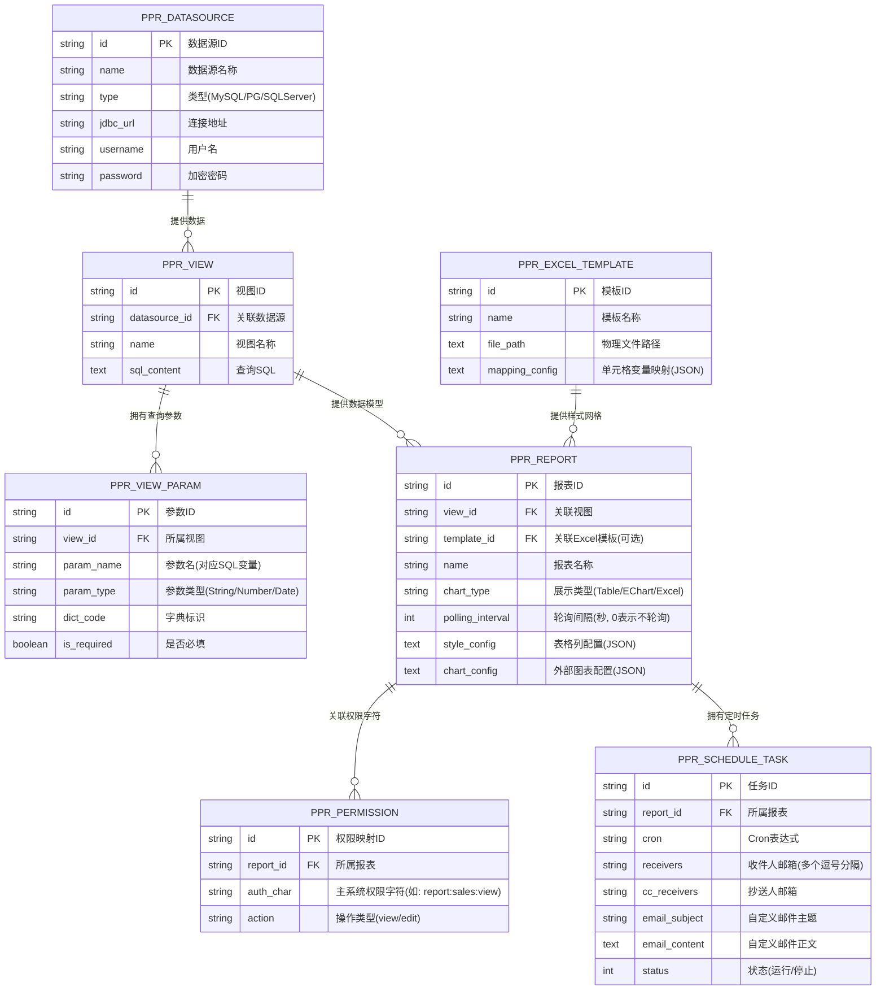
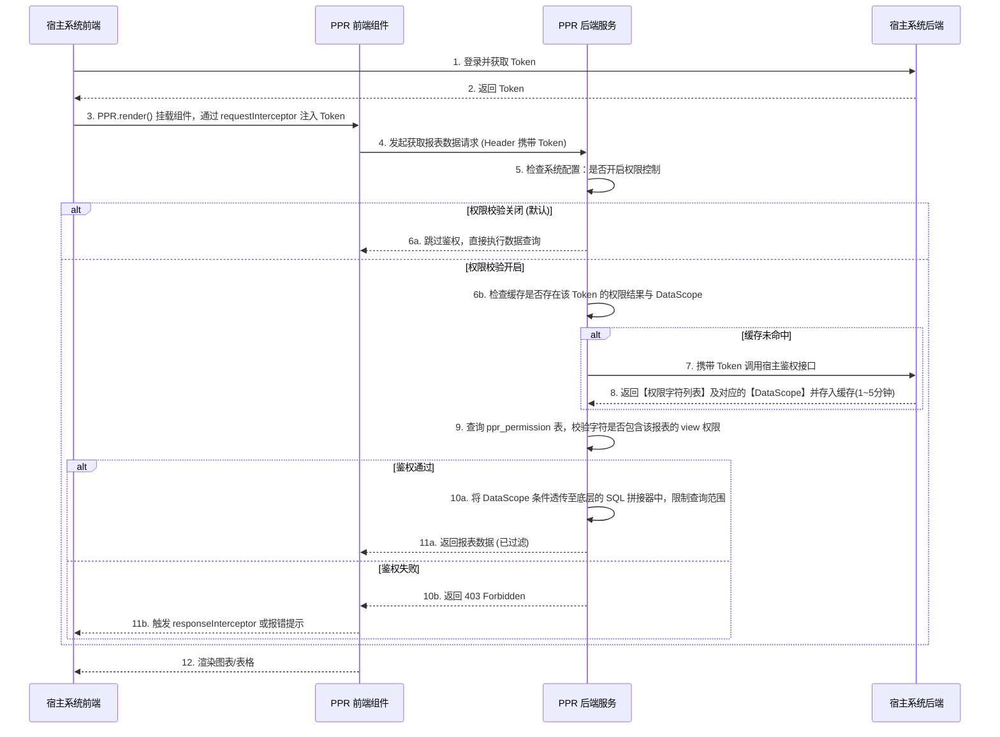
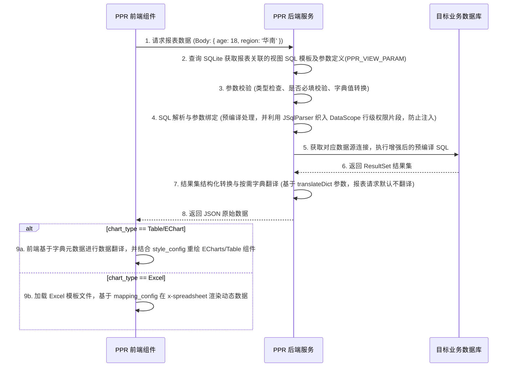

PPR (Perfect Panel Report)

### 1.2 项目背景与目标
PPR 是一个灵活、轻量且易于集成的报表与数据展示系统。它旨在为现有业务系统提供开箱即用的报表设计、数据查询展示、复杂 Excel 导出及定时推送功能，而无需业务系统自行开发繁琐的报表模块。系统本身不维护用户体系和角色标识，作为独立的应用运行，通过 Token 透传方式无缝接入主系统权限体系（后台请求主系统接口获取权限字符），极大降低二次开发成本。

## 2. 核心技术栈
### 2.1 后端技术栈
* **核心语言与框架:** Java 17, Spring Boot
* **微服务集成:** 支持 Nacos 微服务集成，但默认情况下，不集成
* **项目构建与管理:** Maven
* **ORM 框架:** MyBatis-Plus (作为操作内置 SQLite 元数据库的主力 ORM)，结合 Spring JDBC / JdbcTemplate (用于动态连接外部多数据源执行用户配置的视图 SQL)
* **动态多数据源路由:** dynamic-datasource-spring-boot-starter (用于在管理系统内置的 SQLite 与外部业务数据源之间实现动态切换与连接池管理)
* **SQL 解析与防注入:** JSqlParser (用于解析用户编写的复杂 SQL，进行语法树级别的安全审查与防注入分析)
* **权限控制:** Sa-Token (无状态/有状态鉴权，依赖 Token 透传校验)
* **Excel 处理:** Easy Excel (主选，流式写出保障性能), Apache POI (备选)
* **定时任务与邮件:** Spring Schedule (底层调度), JavaMailSender (基于 Spring Boot Starter Mail，支持 SMTP 协议发信)
* **数据库支持:** 
  * 内置元数据库: SQLite (轻量级本地存储配置与元数据)
  * 业务数据源支持: MySQL, SQL Server, PostgreSQL

### 2.2 前端技术栈
* **核心框架与构建:** Vue 3 + Element Plus (按需引入以减小打包体积) + Vite (用于报表组件、查询面板、管理控制台开发)
* **CSS 样式引擎:** UnoCSS (按需生成原子化 CSS，极大地减小 CSS 产物体积，特别适合作为可嵌入组件以减少样式冲突)
* **状态管理:** Pinia (管理应用全局状态，如鉴权信息、主题配置、当前活跃的视图参数)
* **图表可视化:** ECharts (底层图表渲染库，采用按需引入机制仅打包所需图表模块以减小体积，样式配置外置)
* **代码编辑器组件:** vue-codemirror6 (基于 CodeMirror 6，极其轻量，用于在视图设计器中编写 SQL，提供语法高亮、自动补全等基础支持)
* **Excel 在线编辑与渲染:** x-spreadsheet (轻量级 Web Excel 组件，用于在浏览器端加载和预览 Excel 模板，提供类似原生 Excel 的可视化网格体验，相比 Luckysheet 能显著减小前端打包体积，支持拖拽配置)
* **集成与挂载:** 
  * 原生 JS 打包 (独立自包含产物，通过 `PPR.render` 挂载)
  * NPM 包封装 (支持 `@ppr/vue` 和 `@ppr/react` 按需引入)

## 3. 功能需求说明
### 3.1 数据展示与查询
数据展示模块支持动态渲染，适配不同的数据结构与业务场景。组件与后端采用标准 HTTP 请求进行数据交互。为了满足实时性数据的展示需求，系统支持**前端主动轮询刷新**机制，用户可在报表配置中灵活设置轮询间隔。

为了满足不同复杂度的需求，数据展示形态划分为以下五种：
1. **简单数据列表:** 仅提供基础的表格数据展示与翻页功能，无复杂的查询条件和操作，适用于纯只读或数据量较小的轻量级报表。
2. **简单数据详情:** 基于指定 ID 或主键，以表单/描述列表（Descriptions）的形式平铺展示单条数据的详细字段信息，常用于下钻查看。
3. **带查询、筛选、排序和详情的复杂数据列表:** 
   * **多条件组合查询:** 顶部提供配置好的查询表单（如文本框、下拉框、日期范围等）。
   * **动态排序与过滤:** 提供列头快速过滤、多字段动态排序功能。
   * **操作列与下钻:** 行级支持“查看详情”等操作按钮，点击后联动展开“简单数据详情”或弹窗。
4. **统计图:** 采用 ECharts 作为底层图表库（如柱状图、折线图、饼图等）。组件仅负责管理对象生命周期和 `data` 属性的绑定，图表的样式配置全部外置，最大化保证系统的可定制性。
5. **Excel 样式网格:** 针对“中国式复杂报表”（如多层级交叉表头、复杂合并单元格、票据凭证样式），直接使用 x-spreadsheet 在前端渲染。通过绑定后台的 Excel 模板与动态数据，向用户呈现原汁原味的电子表格展示效果（支持只读或在线预览）。

* **主题切换:** 支持内置多套主题风格（如浅色/深色模式、企业蓝等），适应不同业务系统的 UI 色调。

### 3.2 报表与视图设计器 (核心解耦设计)
为实现“数据获取”与“样式呈现”的彻底分离，系统将原本的“表格设计器”拆分为两个独立的配置模块：**视图设计器 (View Designer)** 和 **报表设计器 (Report Designer)**。

#### 3.2.1 视图设计器 (View Designer)
负责底层**数据模型与查询逻辑**的构建，其产物（视图 ID）不仅可供报表使用，也可作为独立的数据接口对外暴露。
* **SQL 建模:** 支持直接配置 SQL 语句提取底层数据源，构建虚拟视图。
* **动态参数设置:** 支持为 SQL 设置动态参数（如 `#{userId}`、`#{startDate}`），配置参数的数据类型、是否必填及默认值。
* **字典与枚举映射:** 字典配置在视图设计器和报表设计器中通用，用于将数据库中的原始值（如 `status=1`）翻译为业务易读标签（如 `生效`）。为保证数据接口的灵活性，**视图数据接口默认返回原始值，不进行字典翻译**，需在请求时增加参数（如 `translateDict=true`）来决定是否执行翻译。
* **接口化能力:** 配置完成的视图，将自动生成一个可供前端或第三方直接调用的 `/api/v1/view/data/{viewId}` 接口。

#### 3.2.2 报表设计器 (Report Designer)
负责数据的**可视化样式与交互配置**，它的输入是一个或多个已配置好的**视图 ID**。
* **极简前端集成:** 在后台完成报表设计后，前端调用时**无需再传递复杂的 options**。前端只需提供 `reportId`，即可渲染出完整的带查询条件、表格/图表样式的报表组件。
* **可视化样式编排:** 提供表头合并、列宽调整、列显隐配置、数据对齐方式等基础与高级表格样式配置。
* **查询条件绑定:** 将“视图设计器”中定义的动态参数，映射为前端报表顶部的具体 UI 控件（如：将 `startDate` 映射为“日期范围选择器”）。
* **图表配置:** 若呈现类型为统计图，可在此上传或填入 ECharts 的 JSON 样式模板。
* **字典与枚举翻译规则:** 报表默认采用关联视图中配置的字典，并且**在前端渲染时进行数据翻译**。为降低服务端压力并保持接口数据纯粹性，后端仅返回原始数据与字典元数据，由前端组件在表格/图表展示前完成映射翻译。若在报表设计器中为特定字段额外配置了字典，前端渲染时将**优先采用报表级的字典配置**进行翻译，覆盖并替代视图级的字典配置。

### 3.3 数据导出与模板设计器 (Excel)
* 支持标准数据列表的高效导出。
* **可视化填空模板设计 (核心特性):**
  * **导入与渲染:** 支持在页面导入普通的 Excel 模板 (.xls/.xlsx) 并在浏览器端**可视化还原渲染**（基于 x-spreadsheet）。
  * **拖拽式绑定:** 用户可以在界面左侧或面板中选择已配置好的**报表/视图**，系统会列出其可用字段。通过**鼠标拖拽**的方式，将字段直接拖入右侧 Excel 预览界面的特定单元格中。
  * **自动生成标识符:** 拖拽完成后，系统会自动按自定义规则将该单元格替换为对应的底层标识符。支持的三大类填充规则为：
    1. **单值变量:** 替换特定的独立单元格占位符。
    2. **列表多行变量:** 即 N 条同结构的数据纵向（向下）自动扩展填充。
    3. **列表多列变量:** 即 N 条同结构的数据横向（向右）自动扩展填充。
* **脱机模板服务:** 支持作为独立的“Excel 渲染引擎”提供服务。外部业务系统可直接调用接口，传入指定的**模板 ID** 与**自行查询好的 JSON 数据**，PPR 负责套用模板进行渲染并返回生成的 Excel 文件，从而无需在 PPR 内建立数据视图模型。
* 大数据量导出性能保障（基于 Easy Excel 的流式写出）。

### 3.4 定时报表发送
* **定时任务调度:** 基于 Spring Schedule 实现底层的任务调度。
* **动态 Cron 管理:** 支持在页面可视化配置 Cron 表达式并存入数据库，支持任务的动态启停、修改和立即执行一次。
* **自动邮件发送:** 定时生成指定报表（Excel 格式），并通过 JavaMailSender 模块（支持全局 SMTP 配置）将生成的 Excel 作为附件发送给目标订阅者（支持群发、抄送配置）。

### 3.5 权限体系
* 采用轻量级权限框架 Sa-Token。
* **全局开关:** 系统支持通过配置文件（如 `application.yml`）全局开启或关闭权限校验。**默认情况下，权限控制为关闭状态**，以便于开发者在初期快速集成与测试。
* **用户无感集成:** (当开启权限时) 系统自身不建用户表，也无角色标识。通过前端拦截器注入 Token 并透传至后端，PPR 后端携 Token 请求主系统的权限接口，主系统返回对应的权限字符。
* **行级数据权限 (DataScope):** 主系统在校验 Token 并返回权限字符时，不仅返回功能操作权限，还需**附带每个权限对应的“数据范围” (DataScope)**（如 `dept_id IN (1,2)` 或 `create_time > '2025-01-01'` 等 SQL 片段或规则）。PPR 在执行底层视图 SQL 时，会利用 JSqlParser 自动拦截并解析原始 SQL，将这些 DataScope 规则动态追加（如通过 `AND` 拼接）到 SQL 的 `WHERE` 条件中，从而实现对“行级数据权限”的透明拦截，防止数据越权访问。
* **鉴权缓存机制:** 校验通过后的权限结果将基于 Token 缓存在本地（或 Redis）1~5 分钟。在有效期内，相同 Token 发起的请求将直接从缓存读取权限，不再重复请求主系统，有效降低鉴权带来的网络延迟和主系统压力。
* **控制粒度:** 权限颗粒度不仅支持报表整体的“查看”和“修改”权限（功能级），还深入到数据行的访问隔离（行级）。

### 3.6 系统日志功能
* **操作日志审计:** 记录用户在系统内的关键操作轨迹（如新增/修改数据源、创建/编辑报表模板、权限配置变更等），包含操作时间、操作人标识、操作 IP、执行方法与参数等。
* **报表访问与导出日志:** 记录报表的查询访问频次、慢 SQL 耗时统计、大批量数据导出行为等，辅助系统性能调优及数据安全审计。
* **定时任务日志:** 详细记录 Spring Schedule 报表发送任务的执行状态（成功、失败、耗时及异常堆栈信息），便于排查任务未送达问题。
* **日志存储与清理:** 默认持久化存储至内置 SQLite 数据库，支持按时间策略（如保留 30 天）自动清理历史日志。

## 4. 前端页面规划
PPR 前端将提供以下核心配置与展示页面：

### 4.1 数据展示页面 (Data Display Page)
* **功能:** 渲染配置好的表格和统计图，提供用户交互（查询表单、排序、翻页、导出按钮）。
* **形态:** 可独立全屏访问，也可作为组件/原生 JS 挂载到宿主系统的任意 DOM 节点中。

### 4.2 视图设计器配置页面 (View Config Page)
* **功能:** 管理数据模型与 SQL 查询逻辑的创建与修改。
* **特性:** 支持在线编写带动态参数的 SQL 语句，设置参数类型及默认值，并在界面内支持**实时查询预览与执行结果验证**。
* **独立接口映射:** 配置好的视图自动产生一个唯一的 `viewId`，可在接口列表中单独查阅其调用方式（类似轻量级的数据中台 API 发布）。

### 4.3 报表设计器配置页面 (Report Config Page)
* **功能:** 为特定的 `viewId` 绑定可视化样式，生成可被外部引用的 `reportId`。
* **特性:** 
  * 将视图的参数映射为 UI 控件（如文本框、下拉框、日期范围选择等）。
  * 在线预览报表实际渲染效果。
  * 可配置表头层级、对齐、显隐、颜色及其他基于前端组件（Element Plus / ECharts）的属性。
  * **数据刷新配置:** 支持开启前端主动轮询刷新，并可自定义轮询间隔（如每 5 秒刷新一次）。

### 4.4 导出与网格模板可视化设计器 (Excel Template Designer)
* **功能:** 可视化管理与配置 Excel 导出与展示模板（上传、在线编辑、下载、更新、删除）。
* **特性:** 
  * 页面左侧提供“数据源面板”，可选择指定的视图或报表，并树状列出其所有的字段与动态参数。
  * 页面右侧嵌入基于 Web 的 Excel 预览器（基于 x-spreadsheet），直接渲染用户导入的 `.xls/.xlsx` 模板文件。
  * 支持从左侧数据源面板直接**拖拽字段到右侧单元格**，系统自动绑定映射关系，实现“所见即所得”的模板变量填充配置。
  * 设计好的模板不仅可用于后端 Excel 导出，也可被报表设计器直接引用为“Excel 样式网格”的呈现模板。

### 4.5 权限配置页面 (Permission Config Page)
* **功能:** 管理与映射来自主系统的权限字符，主要控制对特定报表/视图的“查看”和“修改”权限。
* **特性:** 配合 Sa-Token 路由与方法鉴权规则进行可视化映射管理。

### 4.6 数据库配置页面 (Database Config Page)
* **功能:** 管理各类业务数据源连接（支持动态添加 MySQL, SQL Server, PostgreSQL）。
* **特性:** 支持在线连接测试，账号密码加密存储，支持连接池核心参数配置。

### 4.7 报表发送配置页面 (Report Sending Config Page)
* **功能:** 配置定时报表邮件推送任务及系统全局邮件服务器 (SMTP)。
* **特性:** 包含选择目标报表、配置 Cron 表达式、设置收件人邮箱/抄送人、邮件正文模板及任务启停状态监控。提供独立的邮件 SMTP 服务器设置弹窗或面板。

### 4.8 系统日志查看页面 (System Log Viewer Page)
* **功能:** 为管理员提供操作日志、报表访问日志及定时任务执行日志的综合查询面板。
* **特性:** 支持按操作类型、时间区间、状态、耗时及操作人进行组合过滤检索，支持查看失败任务或异常 SQL 的详细堆栈信息。

### 4.9 开箱即用的独立管理控制台 (Standalone Admin Console)
* **功能:** 提供一个可直接访问、部署即用的统一管理后台，作为整个 PPR 系统的“报表中心”。
* **集成方式:** 将上述 4.1 ~ 4.8 章节的各个功能页面（数据展示、设计器、权限、数据库等），通过 Vue 组件的形式整体拼装在一个标准的中后台布局中（左侧导航菜单 + 顶部 Header + 右侧内容区）。
* **特性:** 
  * **独立运行:** 若业务系统无需将报表功能深度嵌入到自身页面内，可直接通过浏览器访问该管理页面，以独立子系统的形态运行。
  * **动态菜单路由:** 配合 Sa-Token 鉴权结果（基于主系统返回的权限字符），动态渲染左侧菜单，隐藏无权访问的系统配置模块，确保功能安全隔离。

## 5. 部署与集成方式
* **前端开发与打包优化规范:**
  * **编译目标提升:** 在 Vite 的构建配置中，必须将 `build.target` 设置为 `es2020` 或 `esnext`。通过利用现代浏览器原生支持的 ES6+ 语法，避免注入大量的 Babel polyfill（兼容性代码），从而有效减小 JS 产物体积。
  * **组件独立打包 (脱离环境限制):** 使用 Vue 3 + Element Plus 开发完整的组件页面，并通过构建工具（如 Vite 和 `unplugin-vue-components` 实现按需加载）将 Vue 运行时及所有 UI 依赖整体打包成独立的 `.js` 静态产物，从而大幅减小最终输出文件的体积。在此过程中，借助 UnoCSS 生成极小的原子化 CSS，**CSS 样式会被直接内联打包进 JS 文件中（实现样式自动注入）**，极大地简化了引入步骤并减少样式冲突的风险。
  * **原生 HTML 极速接入:** 宿主系统（如传统 JSP、纯 HTML、jQuery 项目等）**无需安装 Vue 和引入额外 CSS**。只需引入打包好的单一 JS 文件，在页面预留 `<div id="ppr-container"></div>`，然后调用暴露在全局的 `PPR.render('#ppr-container', options)` 即可完成整个报表模块的无缝渲染。
    * **`options` 核心参数包含:**
      * `reportId`: 需渲染的报表唯一标识。
      * `chartType`: 渲染类型（如：统计图或数据表）。
      * `pollingInterval`: 前端主动轮询间隔（覆盖报表默认配置，单位秒）。
      * `requestInterceptor` / `responseInterceptor`: 请求响应拦截器（例如用于在 Header 中动态添加 Token 等配置）。
      * `onLoad`: 报表组件加载完成的生命周期钩子函数。
  * **现代框架接入:** 提供独立的 NPM 包（如 `@ppr/vue` 和 `@ppr/react`），供基于 Webpack/Vite 的现代前端工程按需引入。引入组件时，**样式同样会自动注入生效**，开发者无需手动 `import` 任何独立的样式文件。
* **后端部署方式:**
  * 作为独立应用运行，提供内置 SQLite 存储元数据，无需外部额外部署中间件。
  * **微服务集成:** 后端支持 Nacos 微服务集成，但默认情况下，不集成。
  * **容器化部署 (Docker):** 提供标准的 `Dockerfile` 与 `docker-compose.yml`。支持通过挂载数据卷 (Volume) 的形式持久化内部 SQLite 数据库文件及日志文件，实现一键镜像拉取与快速启动。

## 6. 接口设计规范
后端接口主要划分为两类：**报表展示端接口**（供外部业务系统前端调用）与 **管理控制台接口**（供 PPR 管理后台配置使用）。

### 6.1 报表展示端接口 (Client API)
* **`GET /api/v1/report/meta/{reportId}`**：获取报表元数据（如图表类型、表头结构、查询条件定义等）。
* **`POST /api/v1/report/data/{reportId}`**：获取报表数据，Request Body 包含用户输入的动态查询参数、分页参数等。
* **`POST /api/v1/view/data/{viewId}`**：(独立视图接口) 允许外部系统直接调用视图获取 JSON 结构化数据，跳过报表样式渲染。支持传入 `translateDict` 参数来判断是否对结果集进行字典翻译（默认不翻译）。
* **`POST /api/v1/report/export/{reportId}`**：基于当前查询条件，导出报表数据为 Excel 文件。
* **`POST /api/v1/template/export/{templateId}`**：(脱机模板导出接口) 允许外部系统直接传入自定义的 JSON 数据作为 Request Body，由 PPR 系统使用指定的 Excel 模板 ID 渲染并返回最终的 Excel 文件，而不依赖内置视图 SQL 查询。

### 6.2 管理控制台接口 (Admin API)
* **数据源管理 (`/api/v1/admin/datasource/*`)**：支持数据源的新增、修改、删除、分页查询及连接测试（Test Connection）。
* **视图设计器管理 (`/api/v1/admin/view/*`)**：视图 SQL 定义、动态参数配置、字典映射关系、视图数据在线预览等。
* **报表设计器管理 (`/api/v1/admin/report/*`)**：报表基础配置、绑定视图 ID、可视化样式编排、外部图表样式 JSON 载入等。
* **权限映射管理 (`/api/v1/admin/permission/*`)**：配置主系统权限字符与特定视图/报表（查看/修改）的映射关联。
* **定时任务与邮件管理 (`/api/v1/admin/schedule/*`)**：配置系统级 SMTP 参数、Cron 表达式、目标收件人（To/Cc）、任务启停及手动触发测试。

## 7. ER 实体关系图
以下是 PPR 内置 SQLite 数据库的核心实体关联模型（用于存储配置元数据，不包含实际业务数据）：



## 8. 核心流程图
### 8.1 外部系统调用 PPR 报表时的鉴权流转过程
本流程展示了当宿主系统前端渲染 PPR 报表时，如何通过 Token 透传完成鉴权交互。



### 8.2 带参数的 SQL 执行与渲染过程
本流程展示了前端传入动态参数后，PPR 后端如何组装、校验并执行 SQL，以及前端如何根据报表类型进行对应渲染。



## 9. 源码目录结构设计
为保证“可嵌入组件产物 + 独立管理控制台 + 后端服务”三者解耦，同时便于后续扩展（多数据源、权限、导出、定时任务），源码目录采用**前后端分离 + 前端多包（可选）**的组织方式。

### 9.1 仓库根目录
```text
PPR/
├─ docs/                         # 项目文档（架构、接口、设计说明）
├─ docker/                       # Dockerfile、docker-compose、容器化脚本
├─ scripts/                      # 构建/发布辅助脚本（可选）
├─ ppr-server/                   # 后端（Spring Boot + Maven）
├─ ppr-web/                      # 前端（Vue3 + Vite）
└─ README.md
```

### 9.2 后端目录结构（ppr-server）
```text
ppr-server/
├─ pom.xml
├─ ppr-server-app/               # Spring Boot 启动模块（聚合依赖、打包入口）
│  ├─ src/main/java/
│  │  └─ com/ppr/
│  │     ├─ PprApplication.java
│  │     ├─ config/              # Spring 配置（序列化、跨域、线程池等）
│  │     ├─ web/
│  │     │  ├─ controller/       # API Controller（Client API + Admin API）
│  │     │  ├─ dto/              # 入参/出参模型（Request/Response）
│  │     │  ├─ interceptor/      # Token 透传、日志、鉴权拦截器
│  │     │  └─ advice/           # 全局异常处理、统一返回体
│  │     ├─ security/            # Sa-Token 集成、权限校验、权限缓存
│  │     ├─ schedule/            # 定时任务调度、Cron 动态管理、邮件发送
│  │     └─ export/              # Excel 导出、模板渲染适配层
│  └─ src/main/resources/
│     ├─ application.yml
│     ├─ db/migration/           # SQLite 元数据库初始化/升级脚本（可选）
│     └─ templates/              # 邮件模板等（可选）
├─ ppr-server-domain/            # 领域层：核心模型、领域服务、业务规则
│  └─ src/main/java/com/ppr/domain/
│     ├─ model/                  # View/Report/Template/Permission 等领域模型
│     └─ service/                # 领域服务（参数校验、字典规则、行级权限拼接策略）
├─ ppr-server-infra/             # 基础设施层：数据访问、外部系统适配、组件封装
│  └─ src/main/java/com/ppr/infra/
│     ├─ meta/                   # 内置 SQLite 元数据库访问（MyBatis-Plus Mapper）
│     │  ├─ entity/
│     │  ├─ mapper/
│     │  └─ repository/
│     ├─ datasource/             # dynamic-datasource 多数据源路由、连接池配置
│     ├─ jdbc/                   # JdbcTemplate 执行外部数据源动态 SQL
│     ├─ sql/                    # JSqlParser 安全审查、DataScope 注入、预编译绑定
│     ├─ dict/                   # 字典元数据加载与缓存
│     ├─ mail/                   # JavaMailSender 封装、附件/正文构建
│     └─ log/                    # 操作日志/访问日志/任务日志落库
└─ ppr-server-api/               # 对外可复用的 API/契约（可选）
   └─ src/main/java/com/ppr/api/
      ├─ constants/
      └─ enums/
```

### 9.3 前端目录结构（ppr-web）
为同时满足三种交付形态：**独立管理控制台**、**原生 JS 单文件挂载**、**NPM 包（Vue/React）**，建议采用 workspace 方式组织多个 package（也可在项目初期先落成单体，后续再拆分）。

```text
ppr-web/
├─ package.json
├─ vite.config.ts
├─ uno.config.ts
├─ packages/
│  ├─ core/                      # 通用核心（请求层、类型、工具、字典翻译）
│  │  ├─ src/api/                # /api/v1/* 封装
│  │  ├─ src/types/              # View/Report/Template 等 TS 类型
│  │  └─ src/utils/
│  ├─ embed/                     # 原生 JS 产物：暴露全局 PPR.render
│  │  └─ src/
│  │     ├─ entry.ts             # IIFE/UMD 入口（根据构建策略）
│  │     └─ render/              # mount/unmount、拦截器注入
│  ├─ admin/                     # 独立管理控制台（4.1~4.9）
│  │  └─ src/
│  │     ├─ pages/               # 各业务页面
│  │     ├─ router/              # 动态路由与菜单
│  │     ├─ store/               # Pinia
│  │     └─ components/
│  ├─ vue/                       # @ppr/vue 组件封装（可选）
│  │  └─ src/
│  └─ react/                     # @ppr/react 组件封装（可选）
│     └─ src/
└─ public/                       # 静态资源（可选）
```

### 9.4 关键约定
1. **接口分层：** `web/controller` 只做协议适配（参数接收/返回体），核心业务落在 `domain`，数据访问与外部依赖在 `infra`。
2. **元数据库与业务数据库分离：** `infra/meta` 固定操作 SQLite 元数据；`infra/jdbc + infra/datasource` 负责外部数据源动态执行。
3. **安全与权限为横切能力：** SQL 安全审查、DataScope 拼接、Sa-Token 校验、日志审计均以独立模块/包组织，避免散落在业务逻辑中。
4. **前端产物解耦：** `core` 复用请求与类型；`embed/admin/vue/react` 只关心各自的构建入口与 UI 组织，减少重复代码。
